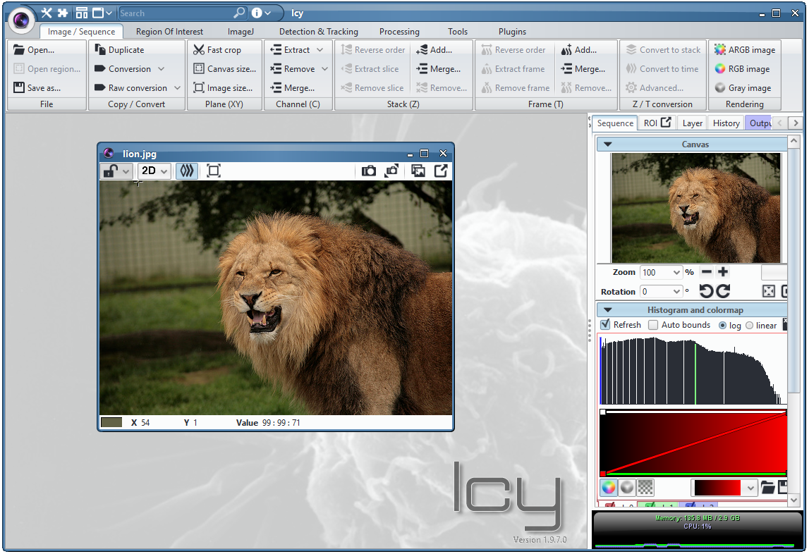
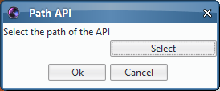
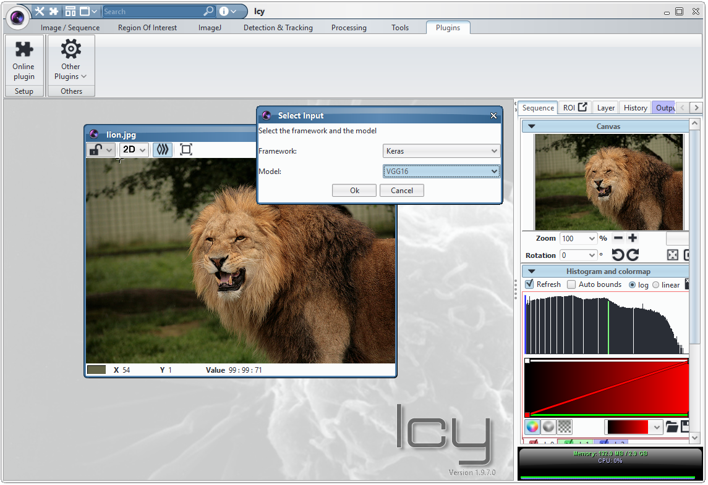
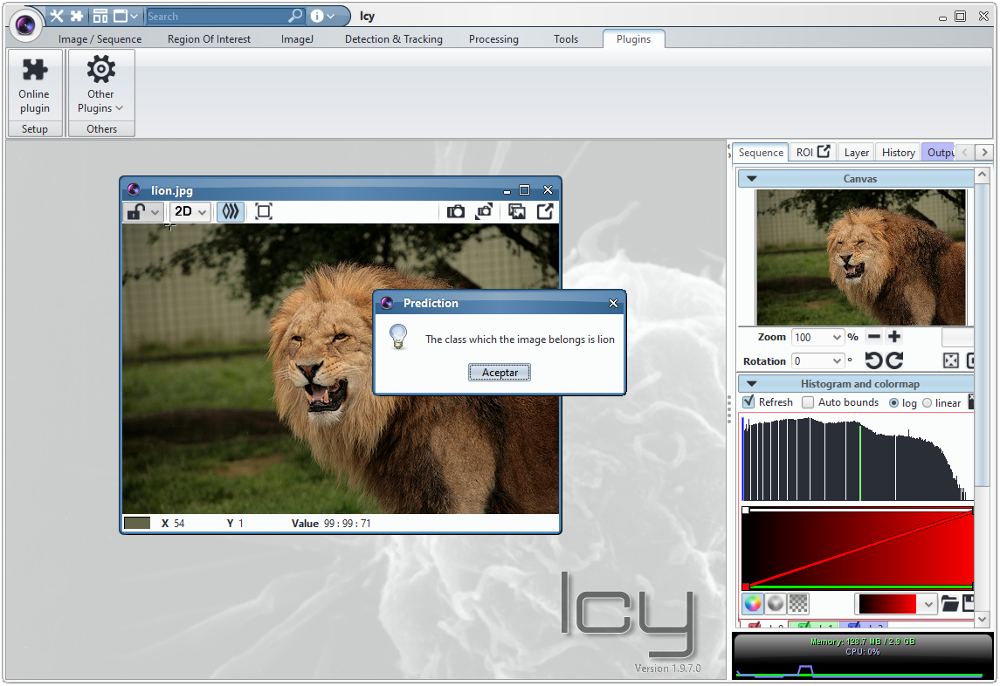

# DeepClas4BioIcy

DeepClas4BioIcy is an Icy plugin that connects Icy with the [DeepClas4Bio API](https://github.com/adines/DeepClas4Bio).  This plugin allows Icy users to use deep learning techniques for object classification abstracting deep learning techniques details. 

## Requirements
To use this plugin is necessary to have installed Icy with Java 8 and download the [DeepClas4Bio API](https://github.com/adines/DeepClas4Bio).

## Installation
This plugin is updated in the Icy repository and the recommendable way to install it is download the plugin using the Icy repository.

## Using the plugin
In this section, we will see an example of how to use this plugin. For this example we will classify a lion image using the VGG16 model from the Keras framework. In addition, you can use the model and the framework that best suits to your problem. 

To use the plugin you must follow the following steps:

 1. Load the image that you want to classify

 2. Run the plugin
 
 Go to Plugins and search DeepClas4BioIcy

 
 3. Indicate the path to DeepClas4Bio API
 

 4. Select the framework and the model you want use
 

 
 5. Visualize the output
 
